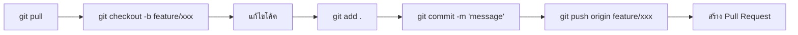

# 📘 Git Cheat Sheet (คู่มือคำสั่ง Git ฉบับภาษาไทย)

> คู่มือรวมคำสั่ง Git ที่ใช้บ่อย พร้อมคำอธิบาย ปัญหาที่พบบ่อย และวิธีแก้ไข

---

## 📑 สารบัญ

- [คำสั่งพื้นฐาน](#-คำสั่งพื้นฐาน)
- [คำสั่ง Branch](#-คำสั่ง-branch-สาขา)
- [คำสั่ง Remote](#-คำสั่ง-remote-เชื่อมต่อ-server)
- [คำสั่งแก้ไข / ย้อนกลับ](#-คำสั่งแก้ไข--ย้อนกลับ)
- [ปัญหาที่พบบ่อยและวิธีแก้](#-ปัญหาที่พบบ่อย-และวิธีแก้)
- [Git Workflow แนะนำ](#-git-workflow-แนะนำ)

---

## 🔰 คำสั่งพื้นฐาน

| คำสั่ง | คำอธิบาย |
|--------|----------|
| `git init` | สร้าง repository ใหม่ในโฟลเดอร์ปัจจุบัน |
| `git clone <url>` | โคลน repository จาก remote มาที่เครื่อง |
| `git status` | ดูสถานะไฟล์ (modified, staged, untracked) |
| `git add <file>` | เพิ่มไฟล์เข้า staging area |
| `git add .` | เพิ่มไฟล์ทั้งหมดเข้า staging area |
| `git commit -m "message"` | บันทึกการเปลี่ยนแปลงพร้อมข้อความ |
| `git log` | ดูประวัติ commit ทั้งหมด |
| `git log --oneline` | ดูประวัติ commit แบบย่อ |
| `git diff` | ดูความแตกต่างของไฟล์ที่เปลี่ยนแปลง |

---

## 🌿 คำสั่ง Branch (สาขา)

| คำสั่ง | คำอธิบาย |
|--------|----------|
| `git branch` | ดู branch ทั้งหมด |
| `git branch <name>` | สร้าง branch ใหม่ |
| `git checkout <branch>` | สลับไปยัง branch ที่ระบุ |
| `git checkout -b <name>` | สร้าง branch ใหม่และสลับไปทันที |
| `git merge <branch>` | รวม branch ที่ระบุเข้ากับ branch ปัจจุบัน |
| `git branch -d <name>` | ลบ branch (ที่ merge แล้ว) |
| `git branch -D <name>` | บังคับลบ branch |

---

## 🌐 คำสั่ง Remote (เชื่อมต่อ server)

| คำสั่ง | คำอธิบาย |
|--------|----------|
| `git remote add origin <url>` | เพิ่ม remote repository |
| `git remote -v` | ดู remote ทั้งหมด |
| `git push origin <branch>` | ส่งโค้ดขึ้น remote |
| `git push -u origin <branch>` | ส่งโค้ดขึ้นและตั้ง upstream tracking |
| `git pull` | ดึงโค้ดล่าสุดจาก remote และ merge |
| `git fetch` | ดึงข้อมูลจาก remote (ไม่ merge) |

---

## ↩️ คำสั่งแก้ไข / ย้อนกลับ

| คำสั่ง | คำอธิบาย |
|--------|----------|
| `git restore <file>` | ยกเลิกการแก้ไขไฟล์ (ก่อน stage) |
| `git restore --staged <file>` | ถอนไฟล์ออกจาก staging area |
| `git reset --soft HEAD~1` | ย้อน commit ล่าสุด (เก็บการเปลี่ยนแปลงไว้ใน stage) |
| `git reset --hard HEAD~1` | ย้อน commit ล่าสุด (ลบการเปลี่ยนแปลงทั้งหมด) |
| `git revert <commit-hash>` | สร้าง commit ใหม่ที่ย้อนกลับ commit ที่ระบุ |
| `git stash` | เก็บงานที่ทำค้างไว้ชั่วคราว |
| `git stash pop` | เอางานที่เก็บไว้กลับมา |

---

## 🔥 ปัญหาที่พบบ่อย และวิธีแก้

### 1. Merge Conflict (ไฟล์ขัดแย้ง)

<details>
<summary>🔻 คลิกดูรายละเอียด</summary>

**อาการ:**
```
CONFLICT (content): Merge conflict in <file>
```

ในไฟล์จะเห็น:
```
<<<<<<< HEAD
โค้ดของเรา
=======
โค้ดของคนอื่น
>>>>>>> branch-name
```

**วิธีแก้:**
```bash
# 1. เปิดไฟล์ที่ conflict แก้ไขให้ถูกต้อง (ลบ <<<<, ====, >>>> ออก)
# 2. จากนั้น
git add <file>
git commit -m "resolve merge conflict"
```

</details>

---

### 2. Push ไม่ได้ เพราะ remote มีของใหม่กว่า

<details>
<summary>🔻 คลิกดูรายละเอียด</summary>

**อาการ:**
```
! [rejected] main -> main (non-fast-forward)
```

**วิธีแก้:**
```bash
git pull origin main        # ดึงของจาก remote มา merge ก่อน
# แก้ conflict ถ้ามี
git push origin main        # แล้วค่อย push
```

</details>

---

### 3. Commit ผิด message

<details>
<summary>🔻 คลิกดูรายละเอียด</summary>

**อาการ:** พิมพ์ข้อความ commit ผิด

**วิธีแก้:**
```bash
git commit --amend -m "ข้อความใหม่ที่ถูกต้อง"
```

> ⚠️ ใช้ได้เฉพาะ commit ที่**ยังไม่ push** ถ้า push ไปแล้วอย่าใช้วิธีนี้

</details>

---

### 4. Commit ไฟล์ที่ไม่ต้องการ (เช่น `node_modules`)

<details>
<summary>🔻 คลิกดูรายละเอียด</summary>

**อาการ:** push ไฟล์ขนาดใหญ่ขึ้นไป

**วิธีแก้:**
```bash
# 1. สร้าง .gitignore
echo "node_modules/" >> .gitignore
echo "build/" >> .gitignore

# 2. ลบ cache ออกจาก git (ไม่ลบไฟล์จริง)
git rm -r --cached node_modules/
git rm -r --cached build/

# 3. commit ใหม่
git commit -m "remove ignored files from tracking"
git push
```

</details>

---

### 5. ทำงานผิด branch

<details>
<summary>🔻 คลิกดูรายละเอียด</summary>

**อาการ:** แก้โค้ดใน `main` แทนที่จะเป็น feature branch

**วิธีแก้:**
```bash
git stash                         # เก็บงานค้างไว้
git checkout -b feature-branch    # สร้าง branch ใหม่
git stash pop                     # เอางานกลับมา
git add .
git commit -m "add feature"
```

</details>

---

### 6. `fatal: not a git repository`

<details>
<summary>🔻 คลิกดูรายละเอียด</summary>

**อาการ:** รันคำสั่ง git แล้วขึ้น error

**วิธีแก้:**
```bash
# ตรวจสอบว่าอยู่ในโฟลเดอร์ที่ถูกต้อง
cd <project-folder>
git init    # ถ้ายังไม่เคย init
```

</details>

---

### 7. ต้องการย้อนไฟล์กลับเป็นเวอร์ชันเก่า

<details>
<summary>🔻 คลิกดูรายละเอียด</summary>

**วิธีแก้:**
```bash
git log --oneline                          # ดู commit hash
git checkout <commit-hash> -- <file>       # ดึงไฟล์จาก commit เก่า
git commit -m "revert file to old version"
```

</details>

---

## 🚀 Git Workflow แนะนำ



### ครั้งแรก (ตั้งค่า)
```bash
git init
git remote add origin <url-ของ-repository>
```

### ทุกครั้งที่ทำงาน
```bash
git pull origin main          # 1. ดึงของล่าสุด
git checkout -b feature/xxx   # 2. สร้าง branch ใหม่
# ... แก้โค้ด ...
git add .                     # 3. เพิ่มไฟล์ทั้งหมด
git commit -m "อธิบายสิ่งที่ทำ"  # 4. บันทึก commit
git push origin feature/xxx   # 5. ส่งขึ้น remote
# 6. สร้าง Pull Request บน GitHub
```

---

## 📌 Tips

- ใช้ `git status` บ่อยๆ เพื่อตรวจสอบสถานะก่อนทำอะไร
- เขียน commit message ให้ชัดเจน เช่น `fix: แก้ bug ตารางแสดงผลผิด`
- อย่า commit ไฟล์ `node_modules/` หรือ `build/` → ใช้ `.gitignore`
- สร้าง branch ใหม่ทุกครั้งก่อนเริ่มทำ feature ใหม่
- ใช้ `git pull` ก่อน `git push` เสมอ

---

> 💡 **สร้างด้วยความรักจากทีมพัฒนา** | อัปเดตล่าสุด: 2026
